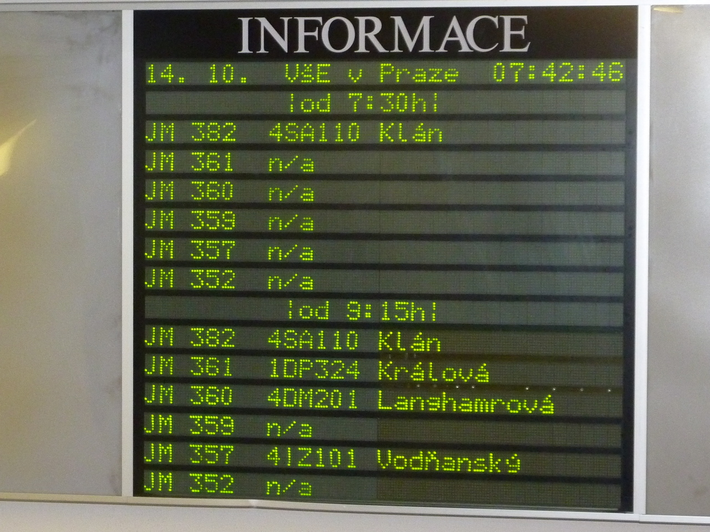

# Timetables

### About

*A Perl script* to fetch and parse arbitrary HTML code
and to design and write custom timetable data in a proprietary file format loaded eventually in an indoor display.

### See [NOTES](NOTES.md).

(c) 2015 Pavel Jurca, University of Economics in Prague
